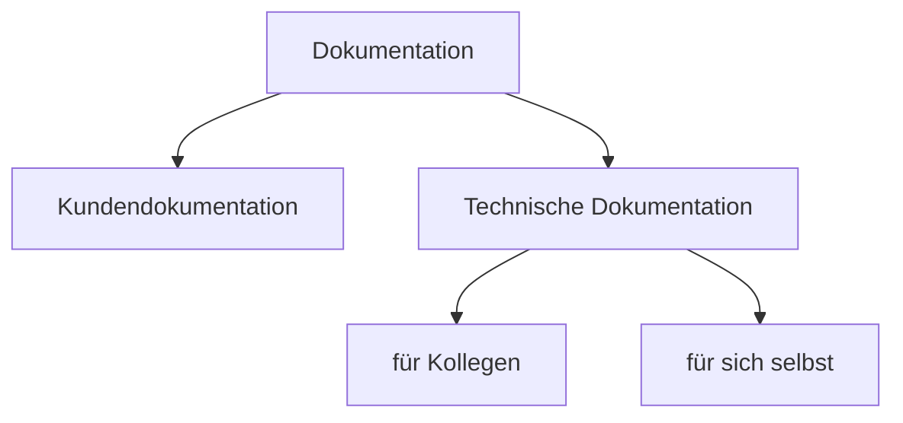

# Dokumentation und Wissensmanagement

<!-- toc -->

## Arten, Nutzer und Ziele von Dokumentation

> **❓❗** Welche Arten von Dokumentation kennen Sie?
>
> An welche Nutzergruppe richtet sich die jeweilige Dokumentation?

> **❓💬** Was sollte beim Erstellen von Dokumentation beachtet werden?

## Wie ist/wird Wissen strukturiert?

> **❓💡** Welche Datenstrukturen sind geeignet, um Wissen zu repräsentieren?

=> es gibt veschiedene Möglichkeiten:

### Linear
z.B.
* Powerpoint-Slides
* Video

### [Verzeichnisbaum / Ordnerstruktur](https://de.wikipedia.org/wiki/Verzeichnisstruktur)

### [Mindmap](https://de.wikipedia.org/wiki/Mindmap)

[Nervenzellen (Neuron), Synapsen, …](https://de.wikipedia.org/wiki/Nervenzelle):

### [Graph](https://de.wikipedia.org/wiki/Graph_(Graphentheorie))

> *Definition:* „Ein **Graph** `G` ist ein Paar `(V,E)`, wobei
>   * `V` eine Menge von **Knoten** (englisch vertex/vertices, oft auch Ecken genannt) und
>   * `E` eine Menge von **Kanten** (englisch edge/edges) bezeichnet.“

> Im Bezug auf Wissensverabeitung können mit Knoten „**Konzepte**“ (Begriffe, Ideen) dargestellt werden und mit Kanten die zwischen den jeweiligen Konzepten existierenden „**Verknüpfungen**“ (Beziehungen, Relationen, Assoziationen).

Aktueller Stand der Forschung:

* Das Menschliche Gehirn „speichert“ Wissen als [*Hyper***Graph**](https://de.wikipedia.org/wiki/Graph_(Graphentheorie)#Hypergraph)
* Die „geordnete Darstellungen einer Menge von Begriffen und der zwischen ihnen bestehenden Beziehungen“ wird in der Informatik als „[**Ontologie**](https://de.wikipedia.org/wiki/Ontologie_(Informatik))“ bezeichnet.
* Das [**Semantic Web**](https://de.wikipedia.org/wiki/Semantic_Web) versucht ein maschinenlesbares **W**orld **W**ide **W**eb aufzubauen
  * Beispiele: [**DBpedia**](https://www.dbpedia.org/), [**Wikidata**](https://www.wikidata.org/)

## Datenformate

> **❓❗** Erklären Sie den Unterschied, zwischen Menschen- und Maschinenlesbaren Datenformaten.

> **❓💡** Welche Datenformate sind gleichermaßen für Menschen und Maschinen lesbar?

### [Form follows function](https://de.wikipedia.org/wiki/Form_follows_function)

1. Sachebene
 * Inhalt
 * Struktur
2. Layout
 * Schriftart, Schriftgröße, … 

### Welche Vorteile ergeben sich, wenn Inhalte für Menschen und Maschinen lesbar sind?

> Beispiel: [Automatische Übersetzung von LaTeX](https://www.johannesloetzsch.de/software/polyglot_tex/)-Dokumenten

> Ausblick: „[Why AI-Models Love Markdown](https://markdownconverters.com/blog/markdown-for-ai)“

### Empfehlung: [Markdown](https://johannesloetzsch.github.io/LF4/oer.html#markdown)

=> ist das für technische Dokumentation verbreitetste Format

 

## Beispiele für Kollaboration

* Wiki:
  * [Wikipedia](https://de.wikipedia.org/wiki/Wikipedia:%C3%9Cber_Wikipedia)
  * [selbst gehostete Wikis](https://de.wikipedia.org/wiki/Liste_von_Wiki-Software)

* von Mitschülern:
  * [LF3](https://hedgedoc.c3d2.de/LF3)
  * [LF4](https://hedgedoc.c3d2.de/LF4_Notes)
  * [LF10a](https://hedgedoc.c3d2.de/AE)

## [Open Educational Resources (OER)](https://johannesloetzsch.github.io/LF4/oer.html)
=> Einführung in `Markdown`, `Werkzeuge` und Übersicht über `frei nutzbare Lernmaterialien`

## Regeln
> 📜 [Vorschlag der FI25](https://hedgedoc.c3d2.de/LF4_Notes#%F0%9F%93%9CRegeln)

### Gesetze
=> bitte beim veröffentlichen von Inhalten beachten:

* [Urheberrecht](https://dejure.org/gesetze/UrhG)
* [Persönlichkeitsrechte](https://de.wikipedia.org/wiki/Pers%C3%B6nlichkeitsrecht_(Deutschland))
  * [Recht am eigenen Bild](https://de.wikipedia.org/wiki/Recht_am_eigenen_Bild_(Deutschland))
  * [Verleumdung](https://dejure.org/gesetze/StGB/187.html)
