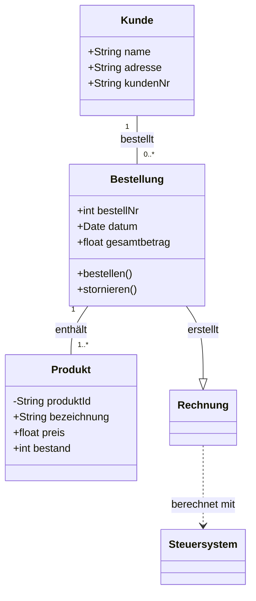
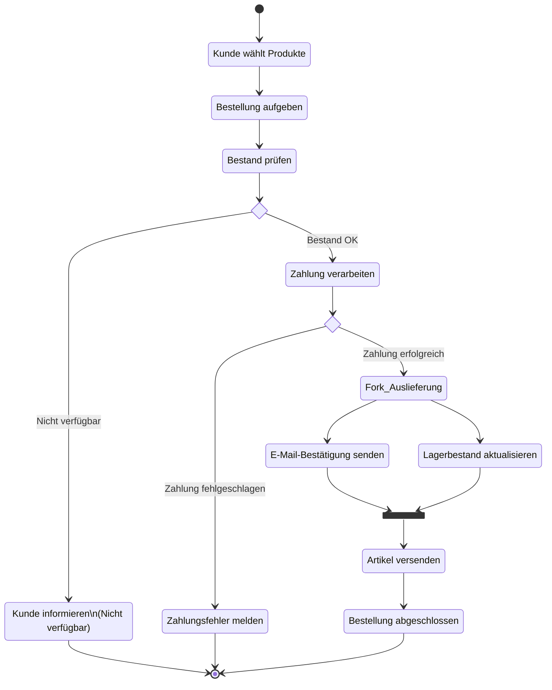
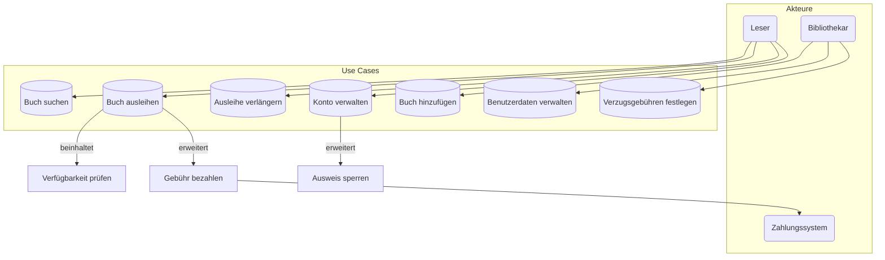

# [UML](https://de.wikipedia.org/wiki/Unified_Modeling_Language)
**U**nified **M**odeling **L**anguage

> [**💡** Notizen](https://github.com/johannesloetzsch/LF7/blob/main/src/pruefung/uml.md) aus bisheriger PV

> **❓❗** Was ist UML?

> **💬** Wofür und wie wird UML in der Praxis genutzt?

> **❓❗** Beschreiben Sie den Unterschied zwischen statischen und dynamischen UML-Diagrammen. Nennen Sie jeweils 3 Beispiele.

> **💬** Welche anderen Diagramme sollten wir kennen?

## Arten von UML Diagrammen

### Strukturdiagramme
- **Klassendiagramm** - zeigt Klassen, Attribute, Methoden und Beziehungen
- **(ER-Diagramm)** - Moddeliert Entitäten und deren Beziehungen (nicht direkt UML, aber oft in Zusammenhang mit UML gebracht)

### Verhaltensdiagramme
- **Aktivitätsdiagramm** - beschreibt Abläufe, Prozesse und Logik
- **Use-Case-Diagramm** - zeigt Akteure und deren Interaktionen mit dem System
- **Zustandsdiagramm** - zeigt Zustände eines Objektes und Übergänge
- **Sequenzdiagramm** - zeigt Interaktion zwischen Objekten über die Zeit

### Sonstige Modelle
- **PAP-Diagramm** - Programmablaufplan zur Darstellung von Abläufen (ähnlich Aktivitätsdiagramm)

## UML-Diagramme im Detail

### Klassendiagramme
Klassendiagramme beschreiben die **statische Struktur** eines Systems.

- Zeigen **Klassen**, **Attribute** und **Methoden**
- Stellen **Beziehungen** zwischen Klassen dar:
  - Assoziation (A kennt B)
  - Aggregation / Komposition (A besteht aus B)
  - Vererbung (A erbt von B)
  - Abhängigkeiten (A nutzt B)
- Eignen sich zur:
  - Modellierung von **Domainmodellen**
  - Planung von **Softwarearchitektur**
  - Dokumentation von **bestehendem Code**

#### Klassendiagramm Beispiel

Dieses Beispiel zeigt die statische Struktur eines einfachen Systems für einen **Online-Shop**.

### Aktivitätsdiagramme
Aktivitätsdiagramme beschreiben **Abläufe und Prozesse** in einem System.

- Zeigen den **Flow von Aktionen** (z.B. Bearbeitung eines Auftrags)
- Eignen sich gut für **Geschäftsprozesse** oder **Ablaufbeschreibungen**
- Enthalten typischerweise:
  - Start- und Endknoten
  - Aktionen (Aktivitäten)
  - Verzweigungen (if/else, Bedingungen)
  - Schleifen
  - Parallelität (Fork/Join)

#### Zweck von Aktivitätsdiagrammen

- Visualisierung von **Geschäftsprozessen** (z.B. Bestellprozess, Reklamation, Anmeldung)
- Unterstützung bei:
  - **Analyse** von Abläufen (Fehler, Medienbrüche, Sonderfälle)
  - **Kommunikation** zwischen Fachbereich und IT
  - **Dokumentation** von Prozessen für Schulungen und Handbücher

#### Zentrale Elemente im Detail

##### Start- und Endknoten
- **Startknoten**
  - Einstiegspunkt des Prozesses 
  - In UML meist als **gefüllter schwarzer Kreis** dargestellt 
- **Endknoten**
  - Markiert das Ende des Ablaufs 
  - Oft als Kreis mit Rand oder spezielles Endsituation-Symbol 
- Ein Aktivitätsdiagramm hat:
  - **genau ein Startknoten**
  - **ein oder mehrere Endknoten** (z.B. "erfolgreich abgeschlossen" vs. "abgebrochen")

##### Aktionen (Aktivitäten)
- Stellen **konkrete Schritte** im Prozess dar, z.B.:
  - "Benutzerdaten erfassen"
  - "Bestand prüfen"
  - "Rechnung erzeugen"
- Werden als **abgerundete Rechtecke** gezeichnet
- Über **gerichtete Kanten** verbunden -> zeigt, in welcher Reihenfolge die Aktionen ablaufen

##### Verzweigungen (Bedingungen / if-else)

- Modellieren **Entscheidungen** im Ablauf:
  - z.B. "Bestand ausreichend?", "Zahlung erfolgreich?"
- **Decision Node**:
  - Wird als **Raute** dargestellt
  - Eingehende Kante, mehrere ausgehende Kanten mit **Bedingungen** (Guards), z.B.
    - `[Bestand OK]`
    - `[Bestand nicht OK]`
- Häufige Struktur:
  - if-Zweig -> weiterer Ablauf
  - else-Zweig -> Fehlerbehandlung oder Abbruch

##### Schleifen

- Dienen zur Darstellung von **Wiederholungen**, z.B.:
  - "solange Eingabe ungültig ist, Eingabe wiederholen"
- Typisch umgesetzt durch:
  - Entscheidungsknoten mit einer Kante, die **zur vorherigen Aktion zurückführt**
- Vorteil:
  - Man erkennt sofort, wo im Prozess etwas **mehrfach passieren kann** (z.B. Validierungen, wiederholte Versuche)

##### Parallelität (Fork/Join)

- Wird verwendet, wenn **mehrere Aktionen gleichzeitig** ausgeführt werden können
- **Fork-Knoten**:
  - Ein eingehender Fluss, **mehrere ausgehende** Flüsse
  - Beispiel:
    - Nach erfolgreicher Bestellung:
      - "E-Mail-Bestätigung senden"
      - "Lagerbestand aktualisieren"
      - "Rechnung erzeugen"
- **Join-Knoten**:
  - Mehrere eingehende Flüsse, **ein ausgehender** Fluss
  - Der Prozess läuft erst weiter, wenn **alle parallelen Aktionen abgeschlossen** sind
- Darstellung in vielen Tools:
  - Fork / Join als **schwarzer Balken**

#### Typische Einsatzgebiete

- **Online-Bestellungen** (z.B. Warenkorb -> Zahlung -> Versand)
- **Genehmigungsprozesse** (Urlaub, Einkauf, Freigaben)
- **Support-Workflows** (Ticket annehmen, bearbeiten, eskalieren)
- **Registrierungs- und Login-Prozesse**
- **Geschäftsprozesse in Verwaltung, Logistik, Produktion** usw.

Aktivitätsdiagramme sind damit ein starkes Werkzeug, um **Abläufe klar, übersichtlich und diskutierbar** zu machen - gerade dann, wenn viele Beteiligte (Kunde, Mitarbeiter, Systeme) zusammenwirken.

#### Aktivitätsdiagramm Beispiel

Dieses Beispiel beschreibt den **Prozess der Bearbeitung einer Online-Bestellung**.

### Use-Case-Diagramme
Use-Case-Diagramme beschreiben, **wie externe Akteure ein System nutzen**.

- Zeigen:
  - **Akteure** (z.B. "Kunde", "System A")
  - **Anwendungsfälle (Use-Cases)**, also typische Nutzungsszenarien
- Beantworten die Frage:
  > *Wer macht was mit dem System?*
- Geeignet für:
  - Anforderungen auf **fachlicher Ebene**
  - Kommunikation mit **nicht-technischen Beteiligten**
  - Überblick über **Funktionalitäten** eines Systems

#### Ziele
- Übersichtlichkeit: Bietet einen klaren Überblick über die Funktionalität des Systems
- Kommunikation: Erleichtert die Abstimmung zwischen Entwicklern, Kunden und anderen Stakeholdern
- Anforderungsanalyse: Unterstützt bei der Identifikation und Definition von Anforderungen
- Grundlage für Design und Test: Dient als Ausgangspunkt für die weitere Systementwicklung und das Testen

#### Bestandteile
- **Akteure**: Repräsentatieren Benutzer oder externe Systeme, die mit dem System interagieren
- **Anwendungsfälle (Use Cases)**: Beschreiben Funktionen oder Dienste, die das System den Akteuren zur Verfügung stellt
- **Systemgrenzen**: Definieren, welche Funktionen und Komponenten Teil des Systems sind
- **Beziehungen**: Zeigen Interaktionen und Abhängigkeiten zwischen Akteuren und Anwendungsfällen

##### Assoziationen / Beziehungen:
- Beschreiben die **Interaktionen zwischen einem Akteur und einem Anwendungsfall**
- Zeigen **welche Akteure welche Use Cases nutzen**
- **Notation**: Durchgezogene Linie zwischen Akteur und Anwendungsfall

###### Include-Beziehung
- Zeigt an, dass ein Anwendungsfall einen anderen Anwendungsfall **immer** einebzieht
- Notation: Gestrichelte Linie mit Pfeil **vom einbeziehenden zum eingebundenen** Anwendungsfall, beschriftet mit `<<include>>`

###### Extend-Beziehung
- Zeigt an, dass ein Anwendungsfall **unter bestimmten Bedingungen einen anderen Anwendungsfall erweitert**
- Der erweiterte Anwendungsfall wird **optional** ausgeführt, wenn bestimmte Bedingungen erfüllt sind
- **Notation**: Gestrichelte Linie mit Pfeil vom erweiternden zum Basis-Anwendungsfall, beschriftet mit `<<extend>>`

###### Bedingungen
- Definieren, **wann** ein erweiternder Anwendungsfall (Extend) ausgeführt wird
- Dienen zur Modellierung **optionaler Abläufe** in bestimmten Situationen
- Wichtig für die **Steuerung von Verhalten**, auch ohne logische Verzweigungen im Diagramm selbst

##### Generalisierung
- Stellt eine **"ist-ein"-Beziehung** dar (Vererbung von Verhalten oder Beziehungen)
- **Akteure**: Spezialisierte Akteure erben die Beziehungen des allgemeinen Akteurs
- **Use Cases**: Spezialisierte Use Cases erben Verhalten und können es erweitern oder anpassen
- **Notation**: Durchgezogene Linie mit offener Pfeilspitze von der Spezialisierung zur Generalisierung

#### Schritte zur Erstellung eines Anwendungsfalldiagramms
1. **Systemgrenzen definieren** (zeichne ein Rechteck und beschrifte es mit dem **Systemnamen**)
2. **Akteure identifizieren** (ermittle, wer mit dem System interagiert; zeichne **Strichmännchen außerhalb der Systemgrenzen**)
3. **Use Cases ermitteln** (identifiziere die **Hauptfunktionen des Systems**; zeichne **Ellipsen innerhalb der Systemgrenze**)
4. **Assoziationen hinzufügen** (verbinde **Akteure** mit ihren **Use Cases** durch einfache Linien)
5. **Beziehungen zwischen Use Cases definieren** (füge **«include»**- oder **«extend»**-Beziehungen hinzu)
6. **Generalisierung einfügen** (falls nötig; verbinde spezielle Arten von **Akteuren** oder **Use Cases** mit **Generalisierungspfeilen**)

#### Use-Case-Diagramm Beispiel

Dieses Use-Case-Diagramm symbolisiert die **Interaktionen der Benutzerrollen (Leser und Bibliothekar) mit den Hauptfunktionen eines Online-Bibliothekssystems**, um dessen funktionalen Umfang darzustellen.

## Tools zum darstellen von Diagrammen

### Textbasiert

Textbasierte Tools beschreiben Diagramme mit einfachem Text.
Das ist praktisch, wenn man Diagramme versionieren, im Team pflegen oder direkt im Code bzw. in Markdown-Dateien ablegen möchte.

#### [PlantUML](https://de.wikipedia.org/wiki/PlantUML)

PlantUML ist ein Werkzeug, bei dem Diagramme über eine einfache, eigene Textsyntax beschrieben werden. 
Aus dieser Beschreibung werden dann Bilder oder SVG-Dateien erzeugt.

Typische Verwendung:

- UML-Diagramme (Klassen, Sequenz, Aktivität, Use-Case, Zustände usw.)
- Architektur-Skizzen in Doku-Wikis oder README-Dateien
- Generierung von Diagrammen direkt aus Build-Prozessen

Stärken:

- Viele UML-Typen werden direkt unterstützt
- Lässt sich gut in IDEs, Wikis und CI-Pipelines einbinden
- Änderungen sind leicht nachzuvollziehen, weil Textdateien gut vergleichbar sind

Schwächen:

- Syntax ist am Anfang etwas gewöhnungsbedürftig
- Optik der Diagramme ist eher funktional als „hübsch“

#### [Mermaid](https://mermaid.js.org/)

Mermaid ist ein JavaScript-basiertes Tool, das besonders gut zu Markdown und Web-Dokumentation passt.
Diagramme werden in Codeblöcken beschrieben (zum Beispiel in einem \`\`\`mermaid-Block) und direkt im Browser gerendert.

Typische Verwendung:

- Dokumentation in Markdown (z. B. HedgeDoc, GitLab, GitHub, Docusaurus)
- Schnell skizzierte Flussdiagramme, Sequenzdiagramme, Klassendiagramme
- ER-Diagramme oder einfache Gantt-Charts

Stärken:

- Funktioniert direkt im Browser, oft ohne zusätzliche Installation
- Ideal für Wikis, Doku-Seiten und Notizen
- Syntax ist relativ kurz und übersichtlich

Schwächen:

- Nicht alle UML-Diagrammarten werden eins zu eins unterstützt
- Layout ist manchmal etwas eigenwillig, Feintuning ist begrenzt

---

### Visuelle Editoren

Visuelle Editoren arbeiten nach dem Prinzip "ziehen und ablegen":
Man baut Diagramme mit der Maus zusammen, ohne eine Textsyntax schreiben zu müssen.

#### [Draw.io](https://app.diagrams.net/)

Draw.io (inzwischen oft als diagrams.net bezeichnet) ist ein kostenloser, browserbasierter Diagramm-Editor.
Diagramme werden per Drag and Drop erstellt und können lokal oder in Cloud-Speichern (z.B. Google Drive, OneDrive) abgelegt werden.

Typische Verwendung:

- Architekturdiagramme, Netzwerkpläne, Organigramme
- Grobe UML-Skizzen für Meetings oder Workshops
- Flussdiagramme und Prozess-Skizzen

Stärken:

- Intuitive Bedienung mit der Maus
- Viele fertige Formen und Symbolbibliotheken
- Export in verschiedene Formate (PNG, JPG, SVG, PDF usw.)

Schwächen:

- Änderungen lassen sich schlechter in Git vergleichen als bei textbasierten Tools
- Für sehr streng aufgebaute UML-Diagramme sind spezialisierte UML-Tools oft angenehmer
